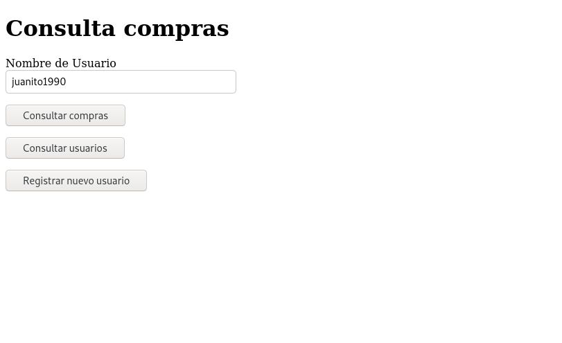
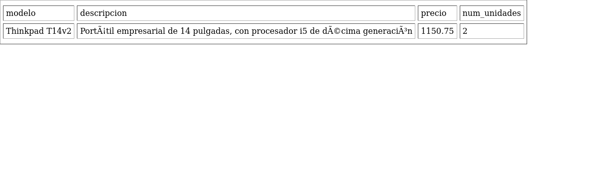

# Store WebApp

## Introducción

Proyecto de desarrollo de una pequeña aplicación web de compras, desplegada sobre Docker, con conexión a una base de datos MySQL.

## Implementación

### 1. Creación de la aplicación web

Para la aplicación web, hemos utilizado flask. La aplicación web se conecta a una base de datos MySQL.

Para esto, hemos creado dos contenedores: uno para la aplicación web, y otro para la base de datos.

- La aplicación web se basa en el contenedor oficial de [python](https://hub.docker.com/_/python).
- La base de datos se basa en el contenedor de [MariaDB](https://hub.docker.com/_/mariadb)

La aplicación web ejecuta el script [webapp.py](https://github.com/AlmuHS/Practica_Docker_MySQL/blob/main/python-webapp/webapp.py), el cual establece la conexión con la base de datos y muestra un pequeño formulario con dos tipos de consultas.

La base de datos se carga mediante el script [test.sql](https://github.com/AlmuHS/Practica_Docker_MySQL/blob/main/mariadb/test.sql), el cual crea las tablas y las rellena con la información perteneciente al inventario de compras de un pequeño comercio.

La base de datos tiene las siguientes credenciales:

- **nombre:** testDB
- **contraseña:** test
- **usuario: ** testusr
- **contraseña root:** testpw

### 2. Dockerfile

Para crear las imágenes de cada contenedor, disponemos de dos Dockerfile

- En la base de datos, su [Dockerfile](https://github.com/AlmuHS/Practica_Docker_MySQL/blob/main/mariadb/Dockerfile) crea la base de datos en sí y carga sus tablas, aprovechándose para ello de una característica propia de la imagen, en la que se puede ejecutar un script SQL copiándolo en un directorio llamado `SQL/` dentro de `/docker-entrypoint-initdb.d`, e invocando a `mysqld` . También expone el puerto 3306, para permitir establecer conexión TCP a MySQL.

- En la aplicación web, el [Dockerfile](https://github.com/AlmuHS/Practica_Docker_MySQL/blob/main/python-webapp/Dockerfile) copia el script y el fichero de requisitos a la imagen, instala sus requisitos mediante pip, expone el puerto 80, y lanza el script mediante Python

### 3. Compilación y despliegue manual de las imágenes

Con toda esta infraestructura, podemos probar el sistema siguiendo los siguientes pasos

#### 3.1. Compilación de las imágenes

##### Descarga de los datos

Para construir las imágenes, debemos clonar el repositorio y situarnos en el directorio de cada imagen

	git clone https://github.com/AlmuHS/Practica_Docker_MySQL.git

##### Construcción de la imagen de la base de datos

Nos situamos en el directorio `mariadb` y usamos el comando `docker build` para construir la imagen

	cd mariadb
	sudo docker build . -t compras-mariadb

Esto nos creará una imagen llamada *compras-mariadb*

##### Construcción de la imagen de la aplicación web

	cd python-webapp
	sudo docker build . -t flask-mariadb

Esto nos creará una imagen llamada *flask-mariadb*

#### 3.2. Lanzamiento de los contenedores

Los comandos anteriores generarán las imágenes, que se quedarán almacenadas en Docker.
Para utilizarlas, debemos lanzar contenedores basados en las mismas.

##### Preparación de la red

Para que los contenedores se puedan comunicar entre sí, estos deben estar situados en la misma red. Esto permitirá acceder a los mismos utilizando simplemente el nombre del contenedor al que queramos conectarnos, sin necesidad de conocer su dirección IP.

Para crear la red, utilizamos el comando `docker network create`. Para simplificar el despliegue, creamos una red de tipo *bridge*, la mas básica.

	sudo docker network create -d bridge mynet

Esto nos creará una red llamada *mynet*

#### Despliegue de los contenedores

Una vez con las imágenes y la red ya preparada, desplegamos los contenedores utilizando el comando `docker run`. **Dado que la aplicación web se conecta a la base de datos, la base de datos debe desplegarse en primer lugar**

##### Despliegue de la base de datos

	sudo docker run --name maria --network mynet -d compras-mariadb

##### Despliegue de la aplicación web

La aplicación web recibe el nombre del contenedor de la base de datos mediante la variable de entorno `MYSQL_HOST`. 

A su vez, el parámetro `-p` permite establecer una redirección entre los puertos del contenedor y del sistema anfitrión. En este caso, redireccionaremos el puerto 5000 (utilizado en la aplicación web) al puerto 8080 del sistema anfitrión. Con esto podremos abrir la página web desde el puerto 8000 de localhost.
  
	sudo docker run --name webapp -e MYSQL_HOST="maria" -d -p 127.0.0.1:8080:5000 --network mynet flask-mariadb

### Prueba del entorno

Para probar el entorno, abrimos el navegador e indicamos la siguiente URL

http://localhost:8080

Si todo ha ido bien, veremos algo como esto:

La aplicación web muestra las compras realizadas por el usuario indicado en el cuadro "Nombre de usuario"-
Para saber la lista de usuarios, pulsamos el botón "Consultar usuarios", que nos mostrará algo como esto:

Volvemos a la página principal pulsando el botón "Atrás" del navegador y, en el cuadro de texto, introducimos el "usuario" que queremos consultar.

Pulsamos en "Consultar compras"

Dependiendo del usuario que hayamos elegido, veremos una lista de compras u otra.

### 4. Publicación de las imágenes

Para subir las imágenes, nos creamos una cuenta en [Docker Hub](https://hub.docker.com/).
En mi caso, la cuenta es "almuhs".

### Publicación de la aplicación web

#### Empaquetado del contenedor

Para empaquetar el contenedor utilizamos el comando `docker commit`. En este indicamos el nombre del contenedor (debe estar en ejecución) y la imagen de partida

	sudo docker commit -p webapp python:3.9-slim

Esto nos empaquetará la aplicación web con el nombre `webapp`.

#### Inicio de sesión en Docker Hub

Iniciamos sesión con el comando `docker login`

	sudo docker login

Nos preguntará sobre nuestro usuario y contraseña. Introducimos los mismos que utilizamos al registrarnos en Docker Hub, y pulsamos Enter para iniciar sesión

Si todo ha ido bien, veremos el mensaje

	Login Succeeded

#### Etiquetado de la imagen

Etiquetamos las imágenes con los nombres con los que lo subiremos a la plataforma. Esta se compondrá de nuestro nombre de usuario, el nombre de la imagen, y la versión. También debemos indicar la imagen original en que se basa.

	sudo docker tag python:3.9-slim almuhs/flask-mysql-compras:v1

#### Subida de la imagen al servidor

Finalmente, subimos la imagen con el comando `docker push`

	sudo docker push almuhs/flask-mysql-compras:v1

Veremos una salida similar a esta  
  
	The push refers to repository [docker.io/almuhs/flask-mysql-compras]
	b9ae38c31d9a: Pushed 
	64520d999c8d: Pushed 
	59c39f155b6c: Pushed 
	86bec3e1156b: Pushed 
	297b05241274: Mounted from library/python 
	677735e8b7e0: Mounted from library/python 
	0315c2e53dfa: Mounted from library/python 
	98a85d041f35: Mounted from library/python 
	02c055ef67f5: Mounted from library/python 
	v1: digest: sha256:550669eb22e369b0b2d8a153f630173a8683ddd0efae1c69855d51b9490c8e92 size: 2206

Tras esto, la imagen se publicará en Docker Hub, con el nombre [almuhs/flask-mysql-compras](https://hub.docker.com/repository/docker/almuhs/flask-mysql-compras)

### Publicación de la base de datos

#### Empaquetado del contenedor

	sudo docker commit -p maria mariadb:latest

Esto nos empaquetará la base de datos con el nombre `maria`

#### Etiquetado del contenedor

**Con la sesión iniciada**, repetimos el proceso realizado con la aplicación web

	sudo docker tag mariadb:latest almuhs/mariadb-compras:v1

#### Subida de la imagen

	sudo docker push almuhs/mariadb-compras:v1

Vemos una salida como esta:

	The push refers to repository [docker.io/almuhs/mariadb-compras]
	d20fade06df0: Pushed 
	773609125c54: Pushed 
	440e3f91cc04: Mounted from library/mariadb 
	d9a849974686: Mounted from library/mariadb 
	f41b3e14204a: Mounted from library/mariadb 
	9f40bb8c365a: Mounted from library/mariadb 
	a29b933b2607: Mounted from library/mariadb 
	cb8ffd04f82a: Mounted from library/mariadb 
	b56be19e2b18: Mounted from library/mariadb 
	fac86ed223e8: Mounted from library/mariadb 
	94478388a6f0: Mounted from library/mariadb 
	feef05f055c9: Mounted from library/mariadb 
	v1: digest: sha256:75dfaf8f7cecbf5276a0859fd5d31467a765184935be87a5a80a2cf052802d6c size: 2827

La imagen queda publicada en Docker Hub, con el nombre [almuhs/mariadb-compras](https://hub.docker.com/repository/docker/almuhs/mariadb-compras)

### 5. Prueba de las imágenes publicadas

Para probar las imágenes publicadas, podemos indicar el nombre de la imagen dentro del comando `docker run`. Esto descargará las imágenes y lanzará los contenedores con la configuración correspondiente

### Probando la imagen de la base de datos

Ejecutamos el comando

	sudo docker run -d --name maria --network mynet almuhs/mariadb-compras:v1

Veremos una salida similar a esta:

	Unable to find image 'almuhs/mariadb-compras:v1' locally
	v1: Pulling from almuhs/mariadb-compras
	c549ccf8d472: Pull complete 
	26ea6552a462: Pull complete 
	329b1f41043f: Pull complete 
	9f8d09317d80: Pull complete 
	2bc055a5511d: Pull complete 
	e989e430508e: Pull complete 
	201c98fa16f6: Pull complete 
	cc09fec0bce1: Pull complete 
	1c9b9043bdda: Pull complete 
	f0e596ee38c5: Pull complete 
	2841ecf560b8: Pull complete 
	a204d876b517: Pull complete 
	Digest: sha256:75dfaf8f7cecbf5276a0859fd5d31467a765184935be87a5a80a2cf052802d6c
	Status: Downloaded newer image for almuhs/mariadb-compras:v1
	4eb36059b7bf2ec03065d70ae4ef30f6cc040b6b1ee849a782fff8568f334638

#### Comprobando su funcionamiento

Comprobamos que la base de datos se ha creado correctamente

	almu@debian:~/Practicas_CC/Tarea6/python-webapp$ sudo docker exec -it maria mysql -utestusr -p
	Enter password: 
	Welcome to the MariaDB monitor.  Commands end with ; or \g.
	Your MariaDB connection id is 3
	Server version: 10.5.10-MariaDB-1:10.5.10+maria~focal mariadb.org binary distribution
	
	Copyright (c) 2000, 2018, Oracle, MariaDB Corporation Ab and others.
	
	Type 'help;' or '\h' for help. Type '\c' to clear the current input statement.
	
	MariaDB [(none)]> show databases;
	+--------------------+
	| Database           |
	+--------------------+
	| information_schema |
	| testDB             |
	+--------------------+
	2 rows in set (0.001 sec)
	
	MariaDB [(none)]> 

### Probando la imagen de la aplicación web

Repetimos el mismo proceso con la imagen de la aplicación web

	sudo docker run -d -e MYSQL_HOST="maria" --name webapp -p 127.0.0.1:8080:5000 almuhs/flask-mysql-compras:v1 --network mynet

Veremos algo similar a lo anterior

	Unable to find image 'almuhs/flask-mysql-compras:v1' locally
	v1: Pulling from almuhs/flask-mysql-compras
	69692152171a: Pull complete 
	59773387c0e7: Pull complete 
	3fc84e535e87: Pull complete 
	68ebeebdab6f: Pull complete 
	3d3af2ef8baa: Pull complete 
	2033dee0f01c: Pull complete 
	364eecd0d134: Pull complete 
	1d6fa5c1d27f: Pull complete 
	9c319a9f508f: Pull complete 
	Digest: sha256:550669eb22e369b0b2d8a153f630173a8683ddd0efae1c69855d51b9490c8e92
	Status: Downloaded newer image for almuhs/flask-mysql-compras:v1
	d47b8096494c952455bab936a97f13817c4f55cb93cf191f8641e2cb041baed0
	

#### Comprobando su funcionamiento

Entramos en la URL http://localhost:8080

Vemos que la página web carga correctamente

## 6. Desplegando los servicios mediante Docker Compose

La ejecución manual de los contenedores es bastante tediosa. Por tanto, para facilitar el proceso, utilizaremos Docker Compose para descargar y lanzar los contenedores con toda la configuración necesaria para que funcionen correctamente.

Además, crearemos un volumen para la base de datos, con el fín de que sus datos puedan persistir una vez finalice la ejecución del contenedor

### Creando el fichero de configuración

Creamos un fichero llamado [*docker-compose.yml*](https://github.com/AlmuHS/Practica_Docker_MySQL/blob/main/docker-compose.yml), en el cual indicaremos la infraestructura a desplegar.

La infraestructura se compone de dos servicios:

- **database:** servicio correspondiente a la base de datos, basado en la imagen [almuhs/mariadb-compras:v1](https://hub.docker.com/repository/docker/almuhs/mariadb-compras). Hace uso del volumen persistente *mariadb-vol*. Despliega un contenedor llamado *maria*

- **webapp**: servicio correspondiente a la aplicación web, basado en la imagen [almuhs/flask-mysql-compras](https://hub.docker.com/repository/docker/almuhs/flask-mysql-compras) .Dependiente del servicio *database*. Despliega un contenedor llamado *webapp*

Además, la infraestructura cuenta con el volumen persistente *mariadb-vol*, conectado al directorio `/var/lib/mysql` de *database*; y una red llamada *mynet*, a la que se conectan ambos servicios.

### Arrancando los servicios

Una vez creado el fichero *docker-compose.yml*, arrancamos los servicios ejecutando el comando `docker-compose up` desde el mismo directorio donde se ubica el fichero.

	sudo docker-compose up -d

Veremos una salida similar a esta:  

	Creating volume "tarea6_mariadb-vol" with default driver
	Creating maria ... done
	Creating webapp ... done

Accedemos a la página para comprobar que todo ha ido correctamente.

### Probando el volumen persistente

Para probar el volumen persistente, registraremos un nuevo usuario en la aplicación, y comprobaremos si, tras reiniciar el contenedor de la base de datos, los datos del mismo se mantienen.

#### Comprobando lista de usuarios

Comprobamos la lista de usuarios, para ver los usuarios registrados en el sistema

#### Registrando usuarios

Rellenamos el formulario con los datos del usuario, y pulsamos "Registrar usuario"

Comprobamos que el usuario aparece en la lista de usuarios

#### Reiniciando la base de datos

Reiniciamos el contenedor de la base de datos, usando el comando

	sudo docker rm -vf maria
	sudo docker-compose up -d

#### Comprobando los datos

Volvemos a consultar la lista de usuarios, para comprobar que el usuario se mantiene

Vemos que el usuario se mantiene en la base de datos

#### Desactivando el volumen 

Para terminar la comprobación, reiniciamos el contenedor de la base de datos sin conectarlo al volumen. Para ello, editamos el fichero `docker-compose.yml`, comentando la sección correspondiente al volumen.

Y repetimos el proceso anterior

	sudo docker rm -vf maria
	sudo docker-compose up -d

Vemos que volvemos a la lista de usuarios original

##### Volviendo a registrar el usuario

Repetimos el proceso anterior

Vemos que el nuevo usuario se ha registrado

##### Reiniciando de nuevo el contenedor y comprobando

Si repetimos el proceso y comprobamos, vemos que el usuario habrá desaparecido

	sudo docker rm -vf maria
	sudo docker-compose up -d
	

